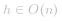
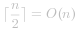

#### 方法一 （递归） 【通过】

这是一个非常经典的树的问题，这个问题很适合用递归方法来解决。

**算法**

反转一颗空树结果还是一颗空树。对于一颗根为 *r*，左子树为 *mbox{right}*， 右子树为 *mbox{left}* 的树来说，它的反转树是一颗根为 *r*，左子树为 *mbox{right}* 的反转树，右子树为 *mbox{left}* 的反转树的树。

```Java []
public TreeNode invertTree(TreeNode root) {
    if (root == null) {
        return null;
    }
    TreeNode right = invertTree(root.right);
    TreeNode left = invertTree(root.left);
    root.left = right;
    root.right = left;
    return root;
}
```

**复杂度分析**

既然树中的每个节点都只被访问一次，那么时间复杂度就是 *O(n)*，其中 *n* 是树中节点的个数。在反转之前，不论怎样我们至少都得访问每个节点至少一次，因此这个问题无法做地比 *O(n)* 更好了。

本方法使用了递归，在最坏情况下栈内需要存放 *O(h)* 个方法调用，其中 *h* 是树的高度。由于  ，可得出空间复杂度为 *O(n)*。

#### 方法二 （迭代） 【通过】

我们也可以用迭代方法来解决这个问题，这种做法和深度优先搜索（Breadth-fist Search, BFS）很接近。

**算法**

这个方法的思路就是，我们需要交换树中所有节点的左孩子和右孩子。因此可以创一个队列来存储所有左孩子和右孩子还没有被交换过的节点。开始的时候，只有根节点在这个队列里面。只要这个队列不空，就一直从队列中出队节点，然后互换这个节点的左右孩子节点，接着再把孩子节点入队到队列，对于其中的空节点不需要加入队列。最终队列一定会空，这时候所有节点的孩子节点都被互换过了，直接返回最初的根节点就可以了。

```Java []
public TreeNode invertTree(TreeNode root) {
    if (root == null) return null;
    Queue<TreeNode> queue = new LinkedList<TreeNode>();
    queue.add(root);
    while (!queue.isEmpty()) {
        TreeNode current = queue.poll();
        TreeNode temp = current.left;
        current.left = current.right;
        current.right = temp;
        if (current.left != null) queue.add(current.left);
        if (current.right != null) queue.add(current.right);
    }
    return root;
}
```

**复杂度分析**

既然树中的每个节点都只被访问/入队一次，时间复杂度就是 *O(n)*，其中 *n* 是树中节点的个数。

空间复杂度是 *O(n)*，即使在最坏的情况下，也就是队列里包含了树中所有的节点。对于一颗完整二叉树来说，叶子节点那一层拥有   个节点。